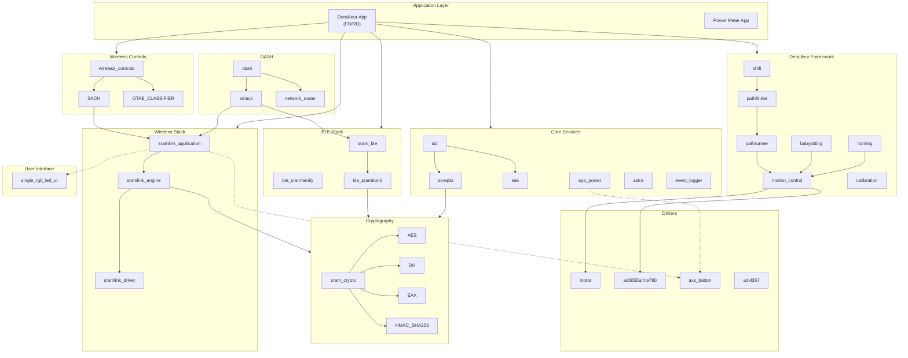
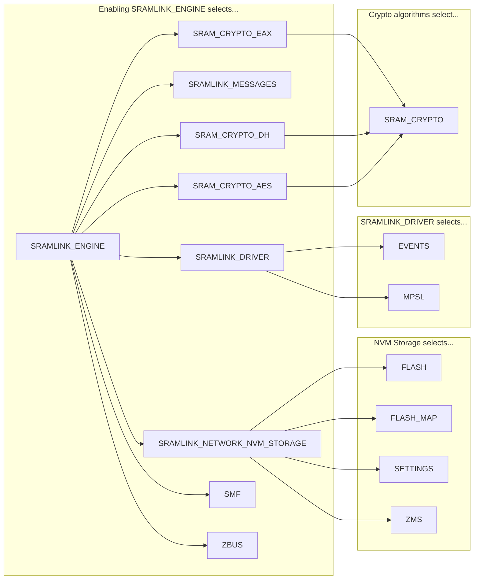
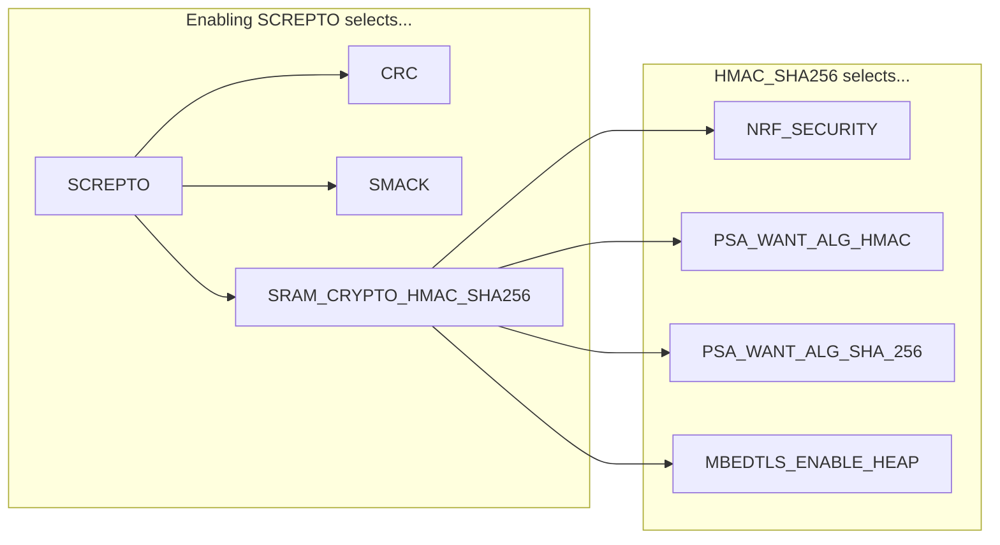
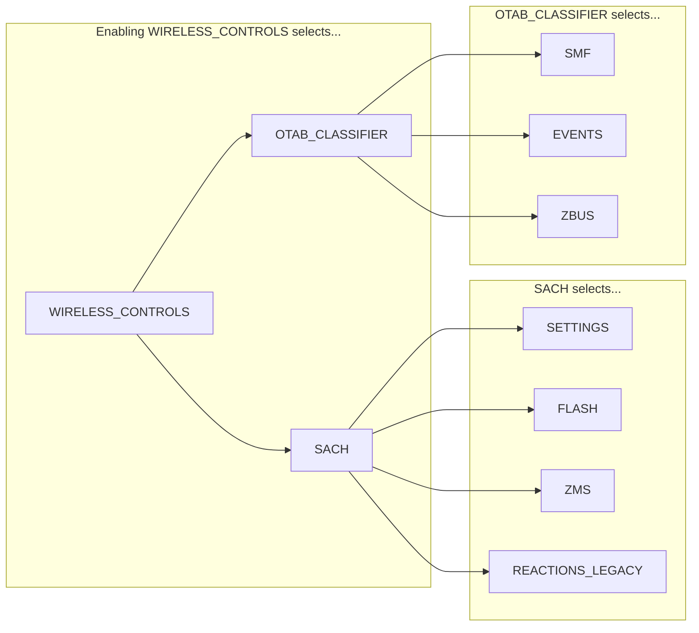
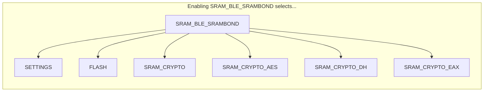
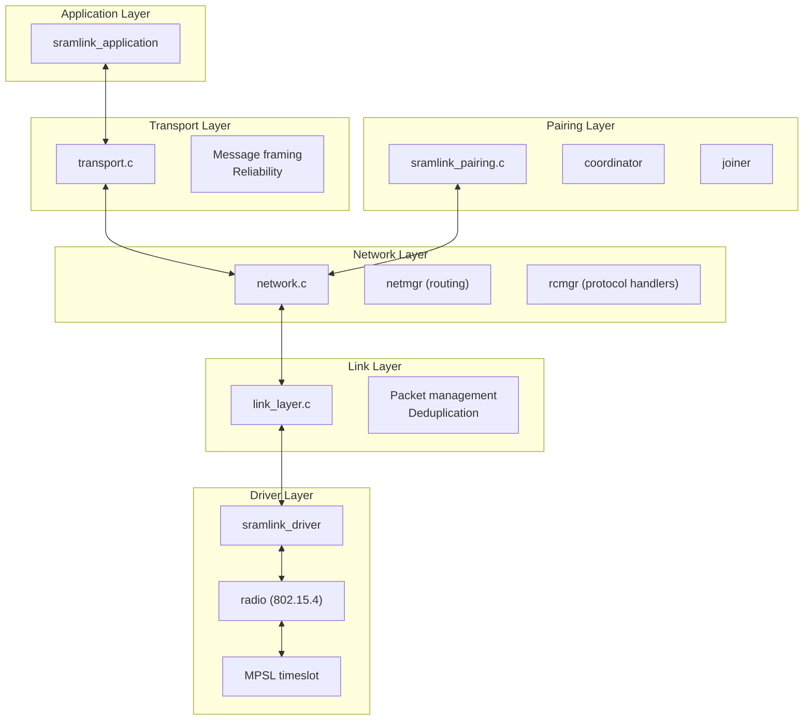
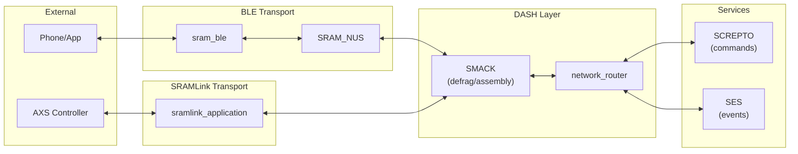

# Cannonball Module Architecture

This document provides a comprehensive view of all modules in the Cannonball firmware system, their dependencies, and how they interconnect.

## Overview

| Category | Count | Location |
|----------|-------|----------|
| Libraries | 24 | `cannonball/libraries/` |
| Subsystems | 6 | `cannonball/subsys/` |
| Drivers | 8 | `cannonball/drivers/` |
| ZBus Channels | 13 | `cannonball/zbus_channels/` + subsys |

---

## High-Level Architecture

---

## Module Groupings by Function

### A. Shifting & Motion Control
- `derailleur_framework` (shift, pathfinder, pathrunner, babysitting, homing, motion_control)
- `drivetrain_service`
- `motor` driver
- encoder drivers (`as5055a`, `ma780`)

### B. Wireless Communication
- `sramlink_engine` (4-layer stack)
- `sramlink_application`
- `sramlink_driver`
- `sramlink_messages`
- `wireless_controls` (SACH, OTAB)

### C. Bluetooth
- `sram_ble` (advertising, SRAMBond)
- `ble_sramfamily` (GATT service)
- `ble_srambond_event_chan`

### D. Security & Config
- `cryptography` (AES, DH, EAX, HMAC)
- `screpto` (secure commands)
- `pconf` (persistent config)

### E. Data & Logging
- `ses` (events)
- `sid` (identifiable data)
- `event_logger`
- `flash_event_logger`
- `rbt` (reliable blob transfer)

### F. System Services
- `app_power` (sleep/wake)
- `watchdog`
- `time_sync`
- `battery`
- `astra` (monitoring)

### G. User Interface
- `single_rgb_led_ui`
- `axs_button` driver
- ledui (via sramlink_application)

### H. Developer/Debug
- `devcomm`
- `shell`
- `partition_cmds`
- `versions`

---

## Kconfig Dependency Chains

### SRAMLINK_ENGINE Dependencies

### SCREPTO Dependencies

### WIRELESS_CONTROLS Dependencies

### SRAM_BLE_SRAMBOND Dependencies

---

## Zbus Channel Pub/Sub Flow

```mermaid
flowchart TB
    subgraph Publishers
        axs_drv["axs_button driver"]
        sramlink_drv["sramlink driver"]
        link_layer["link_layer"]
        network["network"]
        transport["transport"]
        joiner["joiner"]
        coordinator["coordinator"]
        ble_bond["ble_srambond"]
        astra_lib["astra"]
        wc["wireless_controls"]
        otab_cls["otab_classifier"]
    end

    subgraph Channels
        axs_ch[/"axs_button_chan"/]
        sl_evt_ch[/"sramlink_event_chan"/]
        ll_evt_ch[/"link_layer_event_chan"/]
        net_evt_ch[/"network_layer_event_chan"/]
        eng_evt_ch[/"sramlink_engine_event_chan"/]
        pair_evt_ch[/"sramlink_pairing_event_chan"/]
        roster_ch[/"roster_event_chan"/]
        bond_ch[/"ble_srambond_event_chan"/]
        astra_ch[/"astra_device_state_chan"/]
        activity_ch[/"activity_event_chan"/]
        action_ch[/"action_request_event_chan"/]
        otab_ch[/"otab_press_event_chan"/]
    end

    subgraph Subscribers
        sl_ux["sramlink_app_ux"]
        ll_sub["link_layer"]
        net_sub["network"]
        trans_sub["transport"]
        app_rx["sramlink_app_rx"]
        adv["ble advertising"]
        sramfam["ble_sramfamily"]
        astra_sub["astra"]
        screpto_auth["screpto_auth_srambond"]
        app_power["app_power"]
        ctrl_sync["controls_sync"]
        default_act["sach_default_actions"]
        wc_sub["wireless_controls"]
        fd_dispatch["fd action_dispatcher"]
        rd_dispatch["rd action_dispatcher"]
    end

    %% AXS Button
    axs_drv --> axs_ch --> sl_ux

    %% SRAMLink driver events
    sramlink_drv --> sl_evt_ch --> ll_sub

    %% Link layer events
    link_layer --> ll_evt_ch --> net_sub

    %% Network layer events
    network --> net_evt_ch --> trans_sub
    net_evt_ch --> joiner

    %% Engine events (to application)
    transport --> eng_evt_ch --> app_rx

    %% Pairing events
    joiner --> pair_evt_ch
    coordinator --> pair_evt_ch
    pair_evt_ch --> adv
    pair_evt_ch --> sl_ux
    pair_evt_ch --> sramfam
    pair_evt_ch --> astra_sub

    %% Roster events
    coordinator --> roster_ch
    default_act --> roster_ch
    roster_ch --> ctrl_sync
    roster_ch --> default_act

    %% BLE bond events
    ble_bond --> bond_ch --> screpto_auth
    bond_ch --> sl_ux

    %% Astra events
    astra_lib --> astra_ch

    %% Activity events (any module can publish)
    activity_ch --> app_power

    %% Wireless controls
    otab_cls --> otab_ch --> wc_sub
    wc --> action_ch --> fd_dispatch
    action_ch --> rd_dispatch
```

---

## SRAMLink Protocol Stack

---

## DASH Routing Architecture

---

## Complete Module Reference

### Libraries (24)

| # | Module | Kconfig | Description |
|---|--------|---------|-------------|
| 1 | app_power | `APP_POWER` | Sleep/reset with system-wide notifications |
| 2 | astra | `ASTRA` | Status monitoring system |
| 3 | battery | `BATTERY` | Battery voltage reading |
| 4 | ble_sramfamily | `BLE_SRAMFAMILY` | BLE GATT service for device info |
| 5 | cryptography | `SRAM_CRYPTO` | AES, DH, EAX, HMAC-SHA256 algorithms |
| 6 | derailleur_framework | Multiple | 3-layer shifting control system |
| 7 | devcomm | `DEVCOMM` | Developer CLI shell |
| 8 | drivetrain_service | `DRIVETRAIN_SERVICE` | SID interface for drivetrain config |
| 9 | event_logger | `EVENT_LOGGER` | Multi-backend event logging |
| 10 | flash_event_logger | `FLASH_EVENT_LOGGER` | Binary logging to external flash |
| 11 | karoo | `KAROOLIB` | Karoo development library |
| 12 | partition_cmds | `NVM_PARTITION_SCREPTO` | NVM partition SCREPTO commands |
| 13 | pconf | `PCONF` | Persistent config to UICR |
| 14 | reliable_blob_transfer | `RBT` | Reliable blob transfer |
| 15 | screpto | `SCREPTO` | Secure device command handling |
| 16 | ses | `SES` | SRAM Eventing System |
| 17 | shell | (none) | SRAM shell library |
| 18 | sid | `SID` | SRAM Identifiable Data |
| 19 | single_rgb_led_ui | `SINGLE_RGB_LED_UI` | RGB LED UI control |
| 20 | smack | (via DASH) | Defragmentation/assembly |
| 21 | sramlink_messages | `SRAMLINK_MESSAGES` | Protocol message definitions |
| 22 | time_sync | `TIME_SYNC` | Wall clock time tracking |
| 23 | versions | (none) | Version info commands |
| 24 | watchdog | `SYSTEM_WATCHDOG` | System-level watchdog |

### Subsystems (6)

| # | Subsystem | Kconfig | Description |
|---|-----------|---------|-------------|
| 1 | ble | `SRAM_BLE` | SRAM-specific BLE integration |
| 2 | dash | `DASH` | Directly Addressable System Hardware |
| 3 | shell | (backends) | Shell backend infrastructure |
| 4 | sramlink_application | `SRAMLINK_APPLICATION` | App-layer SRAMLink abstraction |
| 5 | sramlink_engine | `SRAMLINK_ENGINE` | 4-layer wireless protocol stack |
| 6 | wireless_controls | `WIRELESS_CONTROLS` | Button controls with multi-device tracking |

### Drivers (8)

| # | Driver | Kconfig | Description |
|---|--------|---------|-------------|
| 1 | axs_button | `AXS_BUTTON` | Button input with tap/long-press |
| 2 | motor | `SRAM_MOTOR` | Motor control via PWM |
| 3 | sramlink | `SRAMLINK_DRIVER` | 802.15.4 radio driver |
| 4 | as5055a | `AS5055A` | AMS rotary encoder |
| 5 | as5055a_fake | `AS5055A_FAKE` | Mock encoder for testing |
| 6 | ma780 | `MPS_MA780` | MPS rotary encoder |
| 7 | sram_adxl367 | `SRAM_ADXL367` | 3-axis accelerometer |
| 8 | ps09 | `PS09` | Strain gauge interface |

### Zbus Channels (13)

| # | Channel | Location | Purpose |
|---|---------|----------|---------|
| 1 | activity_event_chan | `zbus_channels/` | Sleep timer reset |
| 2 | sramlink_pairing_event_chan | `zbus_channels/` | Pairing state |
| 3 | sramlink_engine_event_chan | `zbus_channels/` | Protocol messages |
| 4 | sramlink_event_chan | `drivers/sramlink/` | Driver events |
| 5 | roster_event_chan | `zbus_channels/` | Peer roster |
| 6 | astra_device_state_chan | `zbus_channels/` | Component state |
| 7 | ble_srambond_event_chan | `zbus_channels/` | BLE security |
| 8 | axs_button_chan | `drivers/axs_button/` | Button events |
| 9 | action_request_event_chan | `subsys/wireless_controls/` | Action dispatch |
| 10 | otab_press_event_chan | `subsys/wireless_controls/` | Button classification |
| 11 | link_layer_event_chan | `subsys/sramlink_engine/` | Link layer events |
| 12 | network_layer_event_chan | `subsys/sramlink_engine/` | Network events |
| 13 | cadence_event_chan | `apps/power_meter/` | Cadence data |
